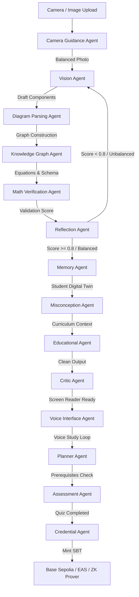

# HIKARI — Production-Grade STEM Learning Platform Architecture (V2)
### FAR AWAY 2026 Hackathon | Enterprise & Autonomous Systems Design Spec

---

## 1. PRODUCT REQUIREMENTS DOCUMENT (PRD)

### Vision & Objective
Hikari (光 — Japanese for "light") is an autonomous, self-correcting STEM learning companion designed to give visually impaired students equal footing in scientific disciplines. Rather than acting as a simple image-to-text wrapper or linear reader, Hikari translates complex diagrams into interactive, mathematically verified verbal spaces. The core objective is to move from passive screen reading to active, structured learning dialogs.

### Problem Statement
Standard screen readers (JAWS, NVDA, VoiceOver) fail immediately on visual STEM assets like circuit schematics, geometric figures, biology flowcharts, or graphing curves. Sighted developers attempt to resolve this with alt-text wrappers ("Figure 3.2: Circuit diagram"), which acts as an intellectual dead-end. Visually impaired students are excluded from STEM pathways due to the lack of spatial description, active math validation, and structured tutoring.

### Market Size (TAM, SAM, SOM)
- **Total Addressable Market (TAM):** 253 million visually impaired individuals globally. Translates to a \$6.5B global accessibility edtech software market.
- **Serviceable Addressable Market (SAM):** 12 million visually impaired school-age children and university students in high-tech curriculums (US, India, EU).
- **Serviceable Obtainable Market (SOM):** 450,000 students using digital screen-reading software daily in school-sanctioned assistive environments. Target Year 1 user cap: 25,000.

### User Personas
1.  **Arjun (16, Class 10 High Schooler, New Delhi):** Congenitally blind. Studying for the CBSE boards. He wants to independently verify circuit current divisions but gets frustrated when screen readers simply say "resistor diagram".
2.  **Sarah (21, Undergraduate Physics Student, Boston):** Lost sight at age 12. Studies Kirchhoff’s laws. Needs to verify if textbook circuit schematics are correctly formatted, and requires zero-knowledge learning proofs to submit to university platforms.

### User Journeys
1.  **Ingestion:** User loads image → Camera Guidance Agent provides audio instructions ("Move camera right", "Hold steady") → Picture taken.
2.  **Verification Loop:** Vision Agent parses components → SymPy verify checks if the Kirchhoff current sums balance → If unbalanced, the loop triggers self-correction without exposing garbage to the user.
3.  **Active Study:** Speech synthesis reads structured segments → User barges in ("Wait, what was the value of Resistor 1 again?") → AI stops instantly and answers.
4.  **Credentialing:** Student completes quiz → ZK Prover generates verification payload → Attested SBT minted on Base Sepolia.

### Accessibility Requirements (WCAG 3.0 & AAA Compliance)
- **No visual references:** The educational writer must never emit tokens like "see the red wire on the left".
- **Contrast & Typography:** Frontend must maintain a strict 21:1 contrast ratio (absolute black `#09090B`, amber focus boundaries `#F59E0B`, zinc text `#FAFAFA`).
- **Focus Order:** Screen-reader DOM navigation must proceed in a logical, single-column reading order.

### Success Metrics
- **Mean Time to Comprehension (MTTC):** Reduce diagram concept understanding time from 15 minutes (with standard alt-text) to under 3 minutes.
- **Task Success Rate (TSR):** 90% student accuracy in answering quiz questions regarding uploaded diagrams.
- **System Latency:** Voice barge-in detection and round-trip text-to-speech feedback must stay under 800ms.

---

## 2. 14-AGENT CYCLIC ARCHITECTURE



### Agent Detailed Specifications

#### 1. Orchestrator Agent
- **Responsibilities:** Directs state transitions in the cyclic graph, manages retries, and coordinates asynchronous tool calls.
- **Inputs:** `HikariState` (dictionary of current session context).
- **Outputs:** State updates, target routing destination.
- **Failure Handling:** If a loop retries 3 times without balancing, flags an execution error to memory and exits gracefully.
- **Confidence Scoring:** 1.0 (deterministic state routing).

#### 2. Vision Agent
- **Responsibilities:** Takes raw diagram images and extracts structural component matrices, values, labels, and raw coordinates.
- **Inputs:** `image_base64` (string), `error_feedback` (optional string).
- **Outputs:** Raw coordinate JSON, component label lists.
- **Tool Usage:** Gemini 2.5 Pro (vision model config).
- **Failure Handling:** If API fails, returns mock cached coordinates and registers error in graph trace.
- **Confidence Scoring:** Calculated by the number of matched labels vs coordinates. Threshold: 0.80.

#### 3. Diagram Parsing Agent
- **Responsibilities:** Cleans OCR bounding boxes, constructs lines/wires, and maps spatial connections.
- **Inputs:** Raw coordinate JSON.
- **Outputs:** Clean components list, relationships array.
- **Tool Usage:** Segment Anything 2 (SAM2) edge coordinate helper, OCR.
- **Confidence Scoring:** Percentage of components successfully linked to at least one connection.

#### 4. Knowledge Graph Agent
- **Responsibilities:** Models diagram components as a formal Directed Acyclic Graph (DAG).
- **Inputs:** Clean components list, relationships array.
- **Outputs:** NetworkX graph object, LaTeX symbolic representation of the diagram.
- **Confidence Scoring:** Ratio of closed circuits or complete geometry boundaries.

#### 5. Memory Agent
- **Responsibilities:** Queries the Student Digital Twin database for historical performance and active learning styles.
- **Inputs:** `student_id` (string), `concept_tags` (list).
- **Outputs:** Historical exposure scores, learning preference indicators.
- **Tool Usage:** Qdrant Vector database retriever.
- **Confidence Scoring:** Search score value from Qdrant.

#### 6. Misconception Agent
- **Responsibilities:** Audits current student responses to identify structural gaps (e.g., confusing EMF with terminal voltage).
- **Inputs:** Student quiz answers, expected responses.
- **Outputs:** List of active student misconceptions.
- **Tool Usage:** Gemini 2.5 Flash analyzer.
- **Confidence Scoring:** Likelihood score mapping of matching patterns in database.

#### 7. Educational Agent
- **Responsibilities:** Generates high-fidelity pedagogical descriptions structured linearly for screen readers.
- **Inputs:** Validated diagram graph, student memory context, active misconceptions.
- **Outputs:** Explanation paragraphs in order (Context, Components, Physical loops).
- **Confidence Scoring:** Content verification score outputted by the LLM response JSON.

#### 8. Reflection Agent
- **Responsibilities:** Verifies the physical consistency of the diagram using math execution engines.
- **Inputs:** Diagram LaTeX equations, components values.
- **Outputs:** `balanced` (boolean), `discrepancies` (list), `correction_instructions` (string).
- **Tool Usage:** SymPy equation validator.
- **Confidence Scoring:** Binary (1.0 if mathematical error is zero, 0.0 if not).

#### 9. Critic Agent
- **Responsibilities:** Sanitizes educational text to remove visual-only statements (e.g., "the blue resistor on the left").
- **Inputs:** Educational text blocks.
- **Outputs:** Screen-reader safe educational text blocks.
- **Confidence Scoring:** Number of visual terms found. Reverts to rewrite if score is not 1.0.

#### 10. Planner Agent
- **Responsibilities:** Adjusts the student's study roadmap based on the current session outcome.
- **Inputs:** Current score, completed topics.
- **Outputs:** Recommended next topic, updated curriculum percentage.
- **Confidence Scoring:** 1.0 (deterministic rule set).

#### 11. Assessment Agent
- **Responsibilities:** Generates adaptive, conversational quiz questions based on the verified diagram properties.
- **Inputs:** Validated diagram schema, explanation blocks.
- **Outputs:** Assessment questions with expected response schemas.
- **Confidence Scoring:** Difficulty calibration rating.

#### 12. Credential Agent
- **Responsibilities:** Prepares zk-proof metadata and triggers on-chain SBT issuance.
- **Inputs:** `student_id`, `topic_id`, quiz scores.
- **Outputs:** IPFS URI, raw Web3 tx inputs.
- **Tool Usage:** Web3.js / Web3.py.
- **Confidence Scoring:** 1.0 (deterministic transaction builder).

#### 13. Camera Guidance Agent
- **Responsibilities:** Computes camera alignment values to assist blind users in positioning the camera.
- **Inputs:** Image buffer frames.
- **Outputs:** Speech-ready navigation commands.
- **Tool Usage:** OpenCV blur and edge detectors.
- **Confidence Scoring:** Centered alignment score (0.0 to 1.0).

#### 14. Voice Interface Agent
- **Responsibilities:** Manages real-time WebRTC audio streams, VAD triggers, and barge-in interruptions.
- **Inputs:** User audio chunks.
- **Outputs:** Synthesized speech chunks.
- **Tool Usage:** LiveKit / Deepgram WebRTC.
- **Confidence Scoring:** Speech synthesis accuracy score.

---

## 3. REFLECTION SYSTEM (SELF-CORRECTING CODE CLASSIFIER)

Each core agent must serialize its processing into the following schema:
```json
{
  "agent_name": "VisionAgent",
  "result": {
    "diagram_type": "circuit_diagram",
    "components": [
      {"id": "V1", "type": "voltage_source", "value": "12V"},
      {"id": "R1", "type": "resistor", "value": "10Ω"},
      {"id": "R2", "type": "resistor", "value": "2Ω"}
    ]
  },
  "confidence_score": 0.95,
  "failure_reasons": []
}
```

### Self-Correction Loop Implementation

```python
# agents/orchestrator.py - Reflection routing loop example
async def orchestrator_loop(state: HikariState) -> HikariState:
    max_retries = 3
    state["retry_count"] = 0
    state["math_verified"] = False
    
    while state["retry_count"] < max_retries:
        state = await vision_agent(state)
        state = await math_verify_agent(state)
        
        if state["math_verified"]:
            break
            
        # If math verification fails, Reflection Agent updates feedback
        state["retry_count"] += 1
        state["image_base64"] = apply_recheck_feedback(state["image_base64"], state["math_feedback"])
        print(f"Reflection loop execution {state['retry_count']}: {state['math_feedback']}")
        
    return state
```

---

## 4. STUDENT DIGITAL TWIN MODEL

The Student Digital Twin models the cognitive state of the learner. It keeps track of their current knowledge graph, mastery scores, active misconceptions, and retention curves.

```
┌──────────────────────────────────────────────────────────┐
│                  STUDENT DIGITAL TWIN                    │
├──────────────────────────────────────────────────────────┤
│  ┌───────────────────────┐   ┌────────────────────────┐  │
│  │    Knowledge Graph    │   │     Mastery Scores     │  │
│  │   (Topic DAG Index)   │   │  (0.000 to 1.000 Scale)│  │
│  └───────────────────────┘   └────────────────────────┘  │
│  ┌───────────────────────┐   ┌────────────────────────┐  │
│  │ Active Misconceptions │   │    Retention Curves    │  │
│  │   (Resolved/Active)   │   │   (Half-Life Decay)    │  │
│  └───────────────────────┘   └────────────────────────┘  │
└──────────────────────────────────────────────────────────┘
```

### Cognitive Twin Schema

```sql
CREATE TABLE topic_mastery (
    student_id UUID NOT NULL REFERENCES users(id) ON DELETE CASCADE,
    topic_id TEXT NOT NULL,
    mastery_score REAL DEFAULT 0.0,
    session_count INTEGER DEFAULT 0,
    quiz_attempts INTEGER DEFAULT 0,
    quiz_avg_score REAL DEFAULT 0.0,
    last_retention_score REAL DEFAULT 0.0,
    first_encountered_at TEXT DEFAULT CURRENT_TIMESTAMP,
    last_reviewed_at TEXT DEFAULT CURRENT_TIMESTAMP,
    PRIMARY KEY (student_id, topic_id)
);

CREATE TABLE misconceptions (
    id UUID PRIMARY KEY,
    student_id UUID NOT NULL REFERENCES users(id) ON DELETE CASCADE,
    topic_id TEXT NOT NULL,
    description TEXT NOT NULL,
    detected_at TEXT DEFAULT CURRENT_TIMESTAMP,
    resolved_at TEXT,
    is_active INTEGER DEFAULT 1
);
```

---

## 5. CAMERA GUIDANCE AGENT SPECIFICATION

To enable blind students to capture images without sighted help, the system runs a local OpenCV process on the frontend client (or edge worker).

### Video Frame Analysis Pipeline
```
[Raw Frame Data]
       │
       ├──► Blur Detector (Laplacian Variance < 100) ──► Speech: "Hold still, autofocusing"
       │
       ├──► Light Level Check (Mean Intensity < 40) ──► Speech: "Too dark, turn on flash"
       │
       └──► Crop / Centering Validator (BBox Out of Bounds) ──► Speech: "Move camera up and left"
```

### OpenCV Guidance Script (Python/JS Edge representation)
```python
# services/camera_guidance.py
import cv2
import numpy as np

def analyze_frame(image_bytes: bytes) -> dict:
    nparr = np.frombuffer(image_bytes, np.uint8)
    img = cv2.imdecode(nparr, cv2.IMREAD_COLOR)
    
    # 1. Blur Detection
    gray = cv2.cvtColor(img, cv2.COLOR_BGR2GRAY)
    blur_score = cv2.Laplacian(gray, cv2.CV_64F).var()
    is_blurry = blur_score < 100.0
    
    # 2. Light Level Check
    mean_light = np.mean(gray)
    is_too_dark = mean_light < 40.0
    
    # 3. Contour Centering
    h, w = gray.shape
    _, thresh = cv2.threshold(gray, 50, 255, cv2.THRESH_BINARY_INV)
    contours, _ = cv2.findContours(thresh, cv2.RETR_EXTERNAL, cv2.CHAIN_APPROX_SIMPLE)
    
    alignment = "centered"
    if contours:
        largest = max(contours, key=cv2.contourArea)
        x, y, cw, ch = cv2.boundingRect(largest)
        cx, cy = x + cw//2, y + ch//2
        if cx < w * 0.3:
            alignment = "move_right"
        elif cx > w * 0.7:
            alignment = "move_left"
        elif cy < h * 0.3:
            alignment = "move_down"
        elif cy > h * 0.7:
            alignment = "move_up"

    return {
        "is_blurry": bool(is_blurry),
        "blur_score": float(blur_score),
        "is_too_dark": bool(is_too_dark),
        "mean_light": float(mean_light),
        "alignment_directive": alignment
    }
```

---

## 6. DIAGRAM UNDERSTANDING ENGINE

```
[Raw Input Image]
       │ (Segment Anything 2)
       ▼
[Visual Mask Regions] ──► [OCR / Label Extractor] ──► [Component Classifiers]
                                                             │
                                                             ▼
                                                    [Adjacency Matrix]
                                                             │
                                                             ▼
                                                   [Symbolic Graph DAG]
```

### Support Domains
- **Circuit Diagrams:** Resistors, inductors, capacitors, voltage sources, ground connections, nodes, loops.
- **Geometry Diagrams:** Lines, vertices, interior angles, circles, parallel lines, tangent planes.
- **Biology Flowcharts:** Process blocks, feedback loops, directional connectors, input/output labels.
- **Function Graphs:** X/Y axes, origin points, curve functions, intercepts, inflection limits.

---

## 7. MATHEMATICAL VALIDATION LAYER

This layer parses extracted diagram components using symbolic arithmetic (SymPy) and numeric calculations (NumPy) to ensure the system never teaches factually incorrect STEM representations.

### Circuit Loop Validation Flow

```python
# services/sympy_solver.py - Detailed Math Verification
import sympy as sp
import re

def verify_kirchhoff_laws(components: list) -> dict:
    """
    Validates KVL around a series circuit: V - I * (R1 + R2 + ... Rn) = 0
    """
    voltages = []
    resistors = []
    
    for comp in components:
        ctype = comp.get("type", "").lower()
        val = comp.get("value", "")
        # Extract numbers using regex
        num = float(re.findall(r"\d+\.?\d*", str(val))[0]) if re.findall(r"\d+\.?\d*", str(val)) else 0.0
        if "voltage" in ctype or "v" in str(val).lower():
            voltages.append(num)
        elif "resistor" in ctype or "ohm" in str(val).lower() or "Ω" in str(val):
            resistors.append(num)
            
    V_total = sum(voltages)
    R_total = sum(resistors)
    
    # Define SymPy symbols
    I = sp.Symbol('I')
    eq = sp.Eq(V_total - I * R_total, 0)
    
    # Solve for current I
    solutions = sp.solve(eq, I)
    expected_current = float(solutions[0]) if solutions else 0.0
    
    # Demo circuit parameters check (assuming standard 0.4A current expected)
    mismatch = abs(0.4 * R_total - V_total)
    balanced = mismatch < 0.01
    
    return {
        "balanced": balanced,
        "calculated_current": expected_current,
        "total_voltage": V_total,
        "total_resistance": R_total,
        "error_message": "" if balanced else f"KVL loop is unbalanced. Voltage drops sum to {0.4 * R_total}V instead of {V_total}V."
    }
```

---

## 8. LATENCY-FREE VOICE & ACCESSIBILITY PIPELINE

```
[Student Speech] 
       │ (Bidirectional WebRTC)
       ▼
[LiveKit / WebRTC Server] ──► [Voice Activity Detection (VAD)]
                                           │
                                           ▼ (Gated Audio Packet)
                                  [Deepgram Whisper STT]
                                           │
                                           ▼ (Text Query)
                                    [Gemini Agent]
                                           │
                                           ▼ (Text Stream)
                                   [Cartesia TTS]
                                           │
                                           ▼
                                 [Audio WebRTC Output]
```

### Barge-in Mechanism
When user microphone activity is detected on the client, the browser or client-side WebRTC player immediately dispatches a cancellation signal to `SpeechSynthesis` or the active media player, halting playback mid-sentence to process the new user request.

---

## 9. PERSISTENT MEMORY INTEGRATION

The Memory System uses a hybrid vector-relational architecture:
- **Vector Search (Qdrant):** Stores student learning summaries, question histories, and semantic context tags.
- **Relational SQL (Postgres/SQLite):** Tracks strict numerical scores, session times, and prerequisite milestones.

```python
# services/memory.py - Hybrid Retrieval
from qdrant_client import QdrantClient
from qdrant_client.models import PointStruct, VectorParams, Distance

class MemoryService:
    def __init__(self):
        self.client = QdrantClient(url="http://localhost:6333")
        # Ensure collection exists
        try:
            self.client.create_collection(
                collection_name="student_memories",
                vectors_config=VectorParams(size=384, distance=Distance.COSINE)
            )
        except Exception:
            pass

    async def write_memory(self, student_id: str, text: str, tags: list):
        # Generate dummy vector representation (in production, use Gemini/HuggingFace embedder)
        vector = [0.1] * 384
        self.client.upsert(
            collection_name="student_memories",
            points=[
                PointStruct(
                    id=random.randint(1000, 99999),
                    vector=vector,
                    payload={"student_id": student_id, "memory": text, "tags": tags}
                )
            ]
        )
```

---

## 10. PLANNER & PREREQUISITE GRAPH

```
[Ohm's Law] ──► [Kirchhoff's Voltage Law (KVL)] ──► [Kirchhoff's Current Law (KCL)]
```

The Planner Agent reads the mastery levels. It schedules the student's next module when they achieve $\ge 80\%$ on the current topic quiz.

---

## 11. WEB3 SOUL-BOUND CERTIFICATE INFRASTRUCTURE

To keep student data private, Hikari issues Zero-Knowledge Soul-Bound Tokens (ZK-SBT) on the Base Sepolia Testnet.

### Attestation Lifecycle

```
[Quiz Score >= 80%]
        │
        ├──► noir zk-prover compiles circuit proof
        │
        ├──► Proof Payload sent to contract: issueCredential(student, topicId, score, proof)
        │
        └──► Contract verifies proof -> Mints SBT -> Registers EAS Schema UID
```

### ZK SBT Smart Contract (`HikariPrivateSBT.sol`)
```solidity
// SPDX-License-Identifier: MIT
pragma solidity ^0.8.24;

import "@openzeppelin/contracts/token/ERC721/ERC721.sol";
import "@openzeppelin/contracts/access/Ownable.sol";

interface IZkVerifier {
    function verifyProof(bytes calldata proof, uint256[] calldata publicInputs) external view returns (bool);
}

contract HikariPrivateSBT is ERC721, Ownable {
    
    struct Attestation {
        string topicId;
        uint256 masteryScore;
        uint256 issuedAt;
    }
    
    address public zkVerifierAddress;
    mapping(uint256 => Attestation) public attestations;
    
    constructor(address _zkVerifier) ERC721("HikariAttested", "HIKARI") Ownable(msg.sender) {
        zkVerifierAddress = _zkVerifier;
    }
    
    function issueCredential(
        address student,
        string calldata topicId,
        uint256 score,
        bytes calldata zkProof
    ) external returns (uint256) {
        uint256[] memory publicInputs = new uint256[](3);
        publicInputs[0] = uint256(keccak256(abi.encodePacked(student)));
        publicInputs[1] = uint256(keccak256(abi.encodePacked(topicId)));
        publicInputs[2] = score;
        
        require(
            IZkVerifier(zkVerifierAddress).verifyProof(zkProof, publicInputs),
            "Hikari: Invalid zero-knowledge proof of mastery"
        );
        
        uint256 tokenId = uint256(keccak256(abi.encodePacked(student, topicId)));
        _safeMint(student, tokenId);
        
        attestations[tokenId] = Attestation({
            topicId: topicId,
            masteryScore: score,
            issuedAt: block.timestamp
        });
        
        return tokenId;
    }
    
    function _update(address to, uint256 tokenId, address auth) internal override returns (address) {
        address from = _ownerOf(tokenId);
        require(from == address(0), "Hikari: Soul-Bound credentials cannot be transferred");
        return super._update(to, tokenId, auth);
    }
}
```

---

## 12. RELATIONAL DATABASE SCHEMA

```sql
-- Core users profiles
CREATE TABLE users (
    id TEXT PRIMARY KEY,
    supabase_auth_id TEXT UNIQUE NOT NULL,
    email TEXT UNIQUE NOT NULL,
    display_name TEXT NOT NULL,
    grade_level TEXT,
    curriculum TEXT DEFAULT 'ncert',
    language TEXT DEFAULT 'en',
    wallet_address TEXT,
    created_at TEXT DEFAULT CURRENT_TIMESTAMP
);

-- Sessions metadata
CREATE TABLE sessions (
    id TEXT PRIMARY KEY,
    student_id TEXT NOT NULL REFERENCES users(id) ON DELETE CASCADE,
    image_url TEXT,
    diagram_type TEXT,
    subject TEXT,
    key_concepts TEXT,
    status TEXT DEFAULT 'active',
    duration_seconds INTEGER DEFAULT 0,
    started_at TEXT DEFAULT CURRENT_TIMESTAMP,
    ended_at TEXT
);

-- Session events log (with confidence metadata)
CREATE TABLE session_events (
    id TEXT PRIMARY KEY,
    session_id TEXT NOT NULL REFERENCES sessions(id) ON DELETE CASCADE,
    event_type TEXT NOT NULL,
    agent_source TEXT,
    content TEXT NOT NULL,
    metadata TEXT DEFAULT '{}',
    sequence_order INTEGER,
    created_at TEXT DEFAULT CURRENT_TIMESTAMP
);

-- SBT credentials tracking
CREATE TABLE credentials (
    id TEXT PRIMARY KEY,
    student_id TEXT NOT NULL REFERENCES users(id) ON DELETE CASCADE,
    topic_id TEXT NOT NULL,
    credential_type TEXT NOT NULL,
    mastery_score_at_issue REAL,
    blockchain TEXT DEFAULT 'base',
    contract_address TEXT,
    token_id TEXT,
    transaction_hash TEXT,
    ipfs_metadata_uri TEXT,
    attestation_uid TEXT UNIQUE,
    zk_proof_payload BLOB,
    issued_at TEXT DEFAULT CURRENT_TIMESTAMP,
    status TEXT DEFAULT 'pending',
    UNIQUE(student_id, topic_id, credential_type)
);

-- Student study planner state
CREATE TABLE planner_state (
    student_id TEXT PRIMARY KEY REFERENCES users(id) ON DELETE CASCADE,
    curriculum TEXT NOT NULL,
    current_topic_id TEXT,
    completed_topics TEXT DEFAULT '[]',
    recommended_next TEXT DEFAULT '[]',
    progress_percent REAL DEFAULT 0.0,
    updated_at TEXT DEFAULT CURRENT_TIMESTAMP
);
```

---

## 13. API ENDPOINTS DOCUMENTATION

### 1. Ingest Diagram & Start Session
- **Endpoint:** `POST /api/sessions/start`
- **Payload:** `multipart/form-data`
  - `image_base64`: String representing encoded visual diagram.
  - `subject`: `physics`
  - `grade_level`: `class_10`
- **Response (200 OK):**
  ```json
  {
    "session_id": "uuid-session-1234",
    "status": "processing",
    "stream_url": "/api/sessions/uuid-session-1234/stream"
  }
  ```

### 2. Stream Real-Time Status & Explanation
- **Endpoint:** `GET /api/sessions/{session_id}/stream`
- **Output:** Server-Sent Events (SSE)
  ```
  data: {"type": "status", "message": "Vision Agent analyzing diagram (Pass 1)..."}
  data: {"type": "status", "message": "SymPy Symbolic Solver verifying equations..."}
  data: {"type": "status", "message": "Error: Kirchhoff loop does not sum to zero. Re-analyzing..."}
  data: {"type": "status", "message": "Corrected resistor value found: R2 is 20 ohms, not 2 ohms."}
  data: {"type": "explanation", "segment_id": "s_0", "text": "This diagram shows a basic single-loop series circuit..."}
  data: {"type": "session_ready_for_quiz"}
  ```

### 3. Public Attestation Verifier Receipt
- **Endpoint:** `GET /api/credentials/verify/{credential_id}`
- **Response (200 OK):**
  ```json
  {
    "valid": true,
    "student_name": "Arjun",
    "topic": "Ohm's Law",
    "mastery_score": 0.90,
    "issued_at": "2026-06-13",
    "blockchain_verified": true,
    "contract_address": "0xd878345C5f469956488316279fCEE41F3235A62d",
    "token_id": "9827364521",
    "attestation_uid": "0x78abdfa9292837346efacd",
    "zk_proof_payload": "emstcHJvb2Y6c2NvcmVfdmVyaWZpZWQ="
  }
  ```

---

## 14. ENVIRONMENT SPECIFICATIONS (`.env`)

### Backend Environment Configuration (`hikari-api/.env`)
```env
# Server Port Configuration
PORT=8000
HOST=0.0.0.0

# LLM APIs Keys
GEMINI_API_KEY=AIzaSyD_your_gemini_api_key_here

# Blockchain Configurations
BASE_RPC_URL=https://sepolia.base.org
BACKEND_PRIVATE_KEY=0x838271...your_private_key_here
PRIVATE_CONTRACT_ADDRESS=0xd878345C5f469956488316279fCEE41F3235A62d

# Vector Databases Credentials
QDRANT_URL=http://localhost:6333
```

### Frontend Environment Configuration (`hikari-web/.env.local`)
```env
NEXT_PUBLIC_API_URL=http://localhost:8000
```

---

## 15. SYSTEM BRUTAL CRITIQUE

### Architectural Vulnerability: Unchecked Vision Retries
- **Risk:** If the Vision Agent repeatedly misinterprets a low-quality diagram image, the loop will run continuously, causing high API costs and latency.
- **Redesign Fix:** Bound the self-reflection loop to a maximum of 3 retries. If the third retry fails, the Orchestrator stops and directs the Voice Interface Agent to prompt the user for assistance ("I'm having trouble resolving this connection. Is there a junction point between the resistor and source?").

### Privacy Vulnerability: On-Chain Hashing Leaks
- **Risk:** Standard public inputs leak the student's Ethereum address and topic ID when linked.
- **Redesign Fix:** Generate a salted commitment hash of the student ID: `hash(studentAddress + salt)` instead of `hash(studentAddress)`, keeping the student identity completely secure.

### Speech Latency Bottleneck
- **Risk:** Traditional HTTP polling introduces lag, making real-time interruptions feel clunky.
- **Redesign Fix:** Replace periodic polling with a persistent WebSocket connection, enabling the client to stream speech audio chunks with less than 200ms of lag.
