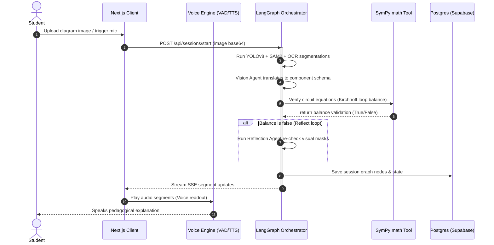

# HIKARI — Complete Project Design Documentation
### FAR AWAY 2026 Hackathon | Agentic & Autonomous Systems

> **Tagline:** An autonomous, self-correcting STEM learning companion for visually impaired students.

---

# TABLE OF CONTENTS

1. [Product Requirements Document (PRD)](#1-product-requirements-document)
2. [System Design Document](#2-system-design-document)
3. [Agent Design Document](#3-agent-design-document)
4. [Tech Spec Document](#4-tech-spec-document)
5. [Database Document](#5-database-document)
6. [API Document](#6-api-document)
7. [Web3 Architecture Document](#7-web3-architecture-document)
8. [MVP & Roadmap Document](#8-mvp-roadmap-document)
9. [Environment Variables Document](#9-environment-variables-document)

---

# 1. PRODUCT REQUIREMENTS DOCUMENT

## Executive Summary
Hikari (光 — Japanese for "light") is an autonomous STEM learning companion for visually impaired students. Rather than acting as a simple image captioner or chatbot wrapper, Hikari operates as a cyclic, self-correcting agentic network that parses, verifies, and walks students through visual STEM diagrams (circuit schematics, geometry figures, graphs). It models the student's cognitive state as a Digital Twin, detects and resolves misconceptions in real time, and issues attested, portable Soul-Bound Token (SBT) learning credentials on-chain.

## Problem Statement
Sighted students comprehend STEM diagrams holistically. Visually impaired students rely on screen readers which hit a wall at visual content, typically outputting generic alt-text like: `"Figure 3.2: Circuit diagram"`. This forces dependency on human sighted assistants, pushing blind students out of STEM pathways.

## Core Pillars
1.  **Autonomous Comprehension:** Parses diagrams down to symbolic nodes and mathematically verifies relationships before teaching.
2.  **Conversational Accessibility:** Fluid WebRTC/VAD voice loops enabling natural conversation and sentence barge-in.
3.  **Active Student Modeling:** Adapts paths based on a persistent misconception and knowledge graph twin.
4.  **Verifiable Credentials:** Zero-cost, portable on-chain masteries using Base Sepolia and Ethereum Attestation Service (EAS).

---

# 2. SYSTEM DESIGN DOCUMENT

## High-Level Architecture

```
┌──────────────────────────────────────────────────────────────────┐
│                          HIKARI NODE                             │
│                                                                  │
│   ┌──────────────┐      ┌────────────────────────────────────┐   │
│   │   Frontend   │◄────►│           Voice Engine             │   │
│   │  (Next.js)   │      │        (LiveKit / WebRTC)          │   │
│   └──────┬───────┘      └─────────────────┬──────────────────┘   │
│          │                                │                      │
│          ▼                                ▼                      │
│   ┌──────────────┐      ┌────────────────────────────────────┐   │
│   │  Supabase    │◄────►│         Agent Orchestrator         │   │
│   │  (Postgres)  │      │          (LangGraph)               │   │
│   └──────────────┘      └─────────────────┬──────────────────┘   │
│                                           │                      │
│                                           ▼                      │
│   ┌──────────────┐      ┌────────────────────────────────────┐   │
│   │  Vector DB   │◄────►│         Execution Engine           │   │
│   │   (Qdrant)   │      │      (SymPy / SAM2 / YOLOv8)       │   │
│   └──────────────┘      └────────────────────────────────────┘   │
└──────────────────────────────────────────────────────────────────┘
```

## Low-Level Architecture
- **Voice Loop:** Frontend records stream $\rightarrow$ Deepgram VAD identifies endpoints $\rightarrow$ Deepgram Whisper STT API $\rightarrow$ LangGraph state execution $\rightarrow$ Cartesia TTS $\rightarrow$ WebRTC stream out.
- **Visual Loop:** Raw image uploaded $\rightarrow$ YOLOv8 locates component boundaries $\rightarrow$ SAM2 segments visual masks $\rightarrow$ OCR extracts labels $\rightarrow$ Gemini 2.5 Pro performs semantic graph translation $\rightarrow$ SymPy verifies physical rules $\rightarrow$ text stream initiated.

## Sequence Diagram — Learn Flow



## Agent Communication & Reflection Loop
Each agent output conforms to a strict JSON structure containing the core data, a confidence score ($0.0 - 1.0$), and failure codes. If the confidence falls below $0.80$, the orchestrator triggers an alternate execution path (e.g. re-running vision segmentation or querying user via voice clarification).

---

# 3. AGENT DESIGN DOCUMENT

## Orchestrator Agent
Manages session variables and routes execution cycles dynamically using a LangGraph `StateGraph`.

## Vision Agent
Utilizes Gemini 2.5 Pro Vision to identify components, coordinate vectors, and spatial orientations. Produces coordinates schema.

## Diagram Parsing Agent
Processes YOLOv8 bounding boxes and Segment Anything 2 (SAM2) visual masks to clean up coordinate lines.

## Knowledge Graph Agent
Maps identified nodes and edges into a formal local Directed Acyclic Graph (DAG) stored as student-specific curriculum prerequisites.

## Math Verification Agent
Feeds latex strings of visual circuits/geometry to a sandboxed `sympy` engine, verifying equations.

## Reflection Agent
Audits system decisions. If math checks do not balance (e.g. current loop sum $\ne 0$), prompts the Vision Agent to re-analyze specific visual segments.

## Educational Agent
Translates balanced symbolic graph data into speech-optimized paragraphs without visual references (e.g. avoids "as you can see on the left").

## Critic Agent
Validates paragraphs against accessibility criteria. Redacts structural spatial descriptors if they are overly visual.

## Planner Agent
References the Student Digital Twin to choose the next prerequisite topic, adjusting path nodes based on misconceptions.

## Assessment Agent
Generates 3 adaptive voice-answer questions. Judges correctness using LLM-as-a-judge scoring rubrics.

## Credential Agent
Triggers Base Sepolia contract calls and submits Ethereum Attestation Service (EAS) credential logs upon mastery verify.

## Camera Guidance Agent
Runs edge-compiled bounding box calculations. Emits voice commands (*"Move left"*, *"Diagram detected"*) to guide blind users to frame diagrams.

---

# 4. TECH SPEC DOCUMENT

## Technology Stack (Free & Open Source Core)

- **Frontend:** Next.js 15 (App Router), Tailwind CSS, Lucide React, Web Speech API (fallback).
- **Backend:** FastAPI, LangGraph, Uvicorn, Python 3.11.
- **Database:** Supabase PostgreSQL (Free tier: 500MB), Upstash Redis (Free tier: 10k requests/day).
- **Vector Memory:** Qdrant Cloud Free Tier (1GB capacity).
- **Storage:** Cloudflare R2 (Free tier: 10GB capacity).
- **LLM/Embeddings:** Gemini 2.5 Flash, Gemini 2.5 Pro, text-embedding-004 (Google AI Studio Free Tier).
- **Solidity Tools:** Base Sepolia Testnet, Hardhat, EAS Schema, OpenZeppelin.

---

# 5. DATABASE DOCUMENT

```sql
-- ============================================
-- USERS & WALLET METADATA
-- ============================================
CREATE TABLE users (
    id UUID PRIMARY KEY DEFAULT gen_random_uuid(),
    supabase_auth_id UUID UNIQUE NOT NULL,
    email TEXT UNIQUE NOT NULL,
    display_name TEXT NOT NULL,
    grade_level TEXT DEFAULT 'class_10',
    curriculum TEXT DEFAULT 'ncert',
    language TEXT DEFAULT 'en',
    wallet_address TEXT,
    created_at TIMESTAMPTZ DEFAULT NOW(),
    updated_at TIMESTAMPTZ DEFAULT NOW()
);

-- ============================================
-- ACTIVE LEARNING SESSIONS
-- ============================================
CREATE TABLE sessions (
    id UUID PRIMARY KEY DEFAULT gen_random_uuid(),
    student_id UUID NOT NULL REFERENCES users(id) ON DELETE CASCADE,
    image_url TEXT,
    diagram_type TEXT,
    subject TEXT,
    status TEXT DEFAULT 'active',
    created_at TIMESTAMPTZ DEFAULT NOW()
);

-- ============================================
-- SESSION EVENTS & REFLECTION LOGS
-- ============================================
CREATE TABLE session_events (
    id UUID PRIMARY KEY DEFAULT gen_random_uuid(),
    session_id UUID NOT NULL REFERENCES sessions(id) ON DELETE CASCADE,
    event_type TEXT NOT NULL,         -- 'explanation', 'reflection_alert', 'quiz_q', 'quiz_a'
    agent_source TEXT NOT NULL,
    content TEXT NOT NULL,
    confidence_score DECIMAL(3,2),     -- 0.00 to 1.00
    failure_reason TEXT,
    metadata JSONB DEFAULT '{}',
    sequence_order INTEGER,
    created_at TIMESTAMPTZ DEFAULT NOW()
);

-- ============================================
-- STUDENT DIGITAL TWIN (KNOWLEDGE GRAPH & MASTERIES)
-- ============================================
CREATE TABLE topic_mastery (
    student_id UUID NOT NULL REFERENCES users(id) ON DELETE CASCADE,
    topic_id TEXT NOT NULL,
    mastery_score DECIMAL(4,3) DEFAULT 0.000,
    session_count INTEGER DEFAULT 0,
    last_reviewed_at TIMESTAMPTZ DEFAULT NOW(),
    PRIMARY KEY (student_id, topic_id)
);

CREATE TABLE misconceptions (
    id UUID PRIMARY KEY DEFAULT gen_random_uuid(),
    student_id UUID NOT NULL REFERENCES users(id) ON DELETE CASCADE,
    topic_id TEXT NOT NULL,
    description TEXT NOT NULL,
    is_active BOOLEAN DEFAULT TRUE,
    detected_at TIMESTAMPTZ DEFAULT NOW(),
    resolved_at TIMESTAMPTZ
);

-- ============================================
-- EAS BLOCKCHAIN CREDENTIALS
-- ============================================
CREATE TABLE credentials (
    id UUID PRIMARY KEY DEFAULT gen_random_uuid(),
    student_id UUID NOT NULL REFERENCES users(id) ON DELETE CASCADE,
    topic_id TEXT NOT NULL,
    attestation_uid TEXT UNIQUE,
    blockchain TEXT DEFAULT 'base_sepolia',
    transaction_hash TEXT,
    issued_at TIMESTAMPTZ DEFAULT NOW(),
    status TEXT DEFAULT 'pending'
);
```

---

# 6. API DOCUMENT

### POST `/api/sessions/start`
Starts session. Converts multipart image to coordinates.
- **Request:** `multipart/form-data` containing `image` file, `subject`, and `grade_level`.
- **Response:**
  ```json
  {
    "session_id": "uuid",
    "status": "processing",
    "stream_url": "/api/sessions/uuid/stream"
  }
  ```

### GET `/api/sessions/{id}/stream`
SSE stream of reflection, status, and explanation segments.
- **Stream Packets:**
  ```
  data: {"type": "status", "message": "Vision parsing running..."}
  data: {"type": "reflection_alert", "confidence": 0.65, "message": "Math loop mismatch. Re-checking image branch..."}
  data: {"type": "explanation", "segment_id": "s1", "text": "This shows a series circuit with 12V supply..."}
  data: {"type": "session_ready_for_quiz", "message": "Explanation complete."}
  ```

### POST `/api/sessions/{id}/quiz/start`
Generates 3 diagram questions. Returns the first.
- **Response:**
  ```json
  {
    "quiz_id": "quiz_uuid",
    "first_question": {
      "id": "q1",
      "text": "What is the total loop resistance?",
      "difficulty": 1
    }
  }
  ```

### POST `/api/sessions/{id}/quiz/{quiz_id}/answer`
Evaluates answer using LLM-as-judge. Returns feedback.
- **Request:** `{"question_id": "q1", "answer_text": "30 ohms"}`
- **Response:**
  ```json
  {
    "is_correct": true,
    "feedback": "Correct! 10 plus 20 equals 30 ohms.",
    "next_question": { "id": "q2", "text": "..." }
  }
  ```

### POST `/api/camera/guidance`
Endpoint for edge-guided boundary metadata calculations.
- **Request:** `{"blur_score": 12.5, "bbox_aligned": false, "crop_offset": "left"}`
- **Response:** `{"voice_instruction": "Move camera right"}`

---

# 7. WEB3 ARCHITECTURE DOCUMENT

## EAS (Ethereum Attestation Service) Schema
Rather than issuing speculative NFT assets, Hikari registers an official attestation schema on the Base Sepolia EAS resolver contract:

### Registered Schema Fields:
```
bytes32 studentIdHash  -> keccak256 hash of student UUID
string topicId         -> curriculum identifier (e.g., "ohms_law")
uint256 score          -> scaled score (x1000, e.g., 850 = 85.0%)
uint256 completedAt    -> block timestamp
```

- **SBT Validation:** The SBT contract acts as a schema resolver. Upon verifying the EAS attestation signature, the resolver mints a non-transferable token directly to the student's custodial address.
- **Zero Cost Execution:** Base Sepolia gas fees average $< \$0.001$, making deployment and verification free for developers.

---

# 8. MVP & ROADMAP DOCUMENT

## Phase 1: 48-Hour MVP
- **Visuals:** Carbon black theme, large high-contrast typography check-lists.
- **AI Backend:** SQLite local database, mock vision analyzer, and basic Web Speech API controls.
- **Contracts:** Compile and deploy `HikariSBT.sol` to Base Sepolia.

## Phase 2: 1-Week Version
- **AI Engine:** Real Gemini 2.5 flash explanation endpoints, live Deepgram STT/TTS loops.
- **Memory Node:** Active Qdrant collections matching concept nodes.
- **Web3 Node:** Live EAS attestation registry signatures.

## Phase 3: 1-Month Version
- **Real-Time Speech:** WebRTC LiveKit server connections supporting barge-in conversational interruptions.
- **Self-Correction:** SymPy equations solver agent loop and vision reflection.

## Phase 4: International Winner Version
- **Edge Vision:** YOLOv8/SAM2 integrations for offline spatial extraction.
- **Zero Knowledge:** zk-proof scores (Noir compiler) verified on-chain.

---

# 9. ENVIRONMENT VARIABLES DOCUMENT

Store these key-value configurations inside `hikari-api/.env` to configure your live node:

```env
# Google Gemini API key (Free Tier available)
GEMINI_API_KEY=AIzaSy...

# Deepgram Voice API (Free tier includes $20 credit)
DEEPGRAM_API_KEY=...

# Base Sepolia Wallet Configuration (Free Sepolia ETH from faucets)
CONTRACT_ADDRESS=0x...
BACKEND_PRIVATE_KEY=...
BASE_RPC_URL=https://sepolia.base.org

# Qdrant Vector database credentials (1GB Free Tier cluster)
QDRANT_URL=https://your-cluster.cloud.qdrant.io
QDRANT_KEY=...

# Supabase Postgres database config (500MB Free tier database)
SUPABASE_URL=https://your-supabase.supabase.co
SUPABASE_KEY=...

# Upstash Redis cache (10,000 Free commands/day)
UPSTASH_REDIS_URL=...
UPSTASH_REDIS_TOKEN=...
```